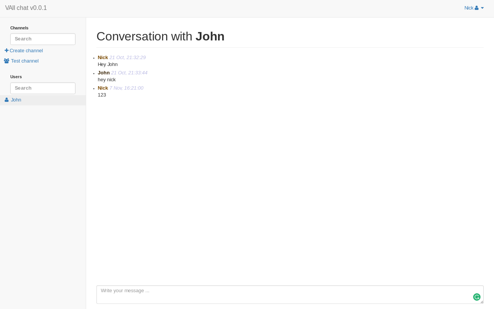

# vaii-chat

# Installation

    git clone git@github.com:juraj0137/vaii-chat.git
    cd vaii-chat/
    npm install

# Run

    gulp

# Instalation MongoDB
##Ubuntu

    sudo apt-key adv --keyserver hkp://keyserver.ubuntu.com:80 --recv 0C49F3730359A14518585931BC711F9BA15703C6
    echo "deb http://repo.mongodb.org/apt/debian jessie/mongodb-org/testing main" | sudo tee /etc/apt/sources.list.d/mongodb-org-3.4.list
    sudo apt-get update
    sudo apt-get install -y mongodb-org
    
##Fedora 24 
Create a ` /etc/yum.repos.d/mongodb-org-3.2.repo` file so that you can install MongoDB directly, using yum.

    
    [mongodb-org-3.2]
    name=MongoDB Repository
    baseurl=https://repo.mongodb.org/yum/redhat/7/mongodb-org/3.2/x86_64/
    gpgcheck=0
    enabled=1
    
    sudo dnf install -y mongodb-org
    

##Start/Stop/Restart database

    sudo service mongod start
    sudo service mongod stop
    sudo service mongod restart

